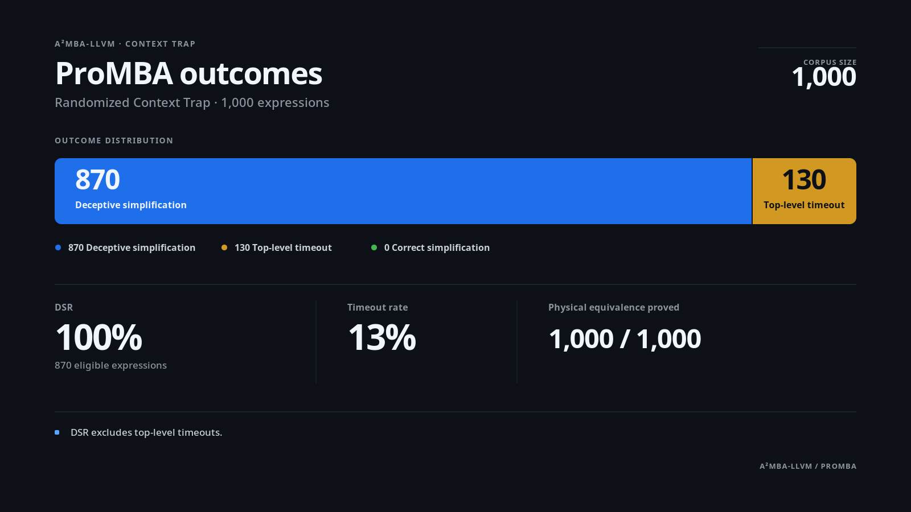

# A²MBA-LLVM

A²MBA-LLVM implements the architectural-hardening and anti-generalization techniques from *Unifying Mixed Boolean-Arithmetic Obfuscation by Architectural and Anti-Generalization Hardening* as an LLVM 21 pass plugin.

This is an independent implementation, not the authors' code or a port of their LLVM 15 prototype. The paper leaves some implementation parameters unspecified; A²MBA-LLVM defines those parameters in its design documentation.

## Scope

- LLVM 21.x only; LLVM 15-20 and 22 or newer are rejected.
- Linux x86-64 and Windows x86-64.
- Scalar `i32` and `i64` integer operations.
- Stock Clang/LLVM through a New-PM loadable plugin; no compiler fork.
- Normal compile and link flows. ThinLTO and Full LTO are not supported in v0.1.

By default, the plugin runs in `verified` mode with the `balanced` profile and touches only explicitly annotated functions. `paper` mode keeps research-oriented behavior out of that production default.

The published resilience and performance figures describe the authors' LLVM 15 prototype. They are not attributed to this implementation. A separate randomized Context Trap evaluation is reported below and in [BENCHMARKING.md](docs/BENCHMARKING.md).

## Build

Build requirements are CMake 3.24+, a C++20 compiler, Python 3.8+ for the wrapper and tests, and an LLVM 21 development package. Install the pinned lit runner before configuring a test build:

```bash
python -m pip install -r requirements-test.txt
cmake -S . -B build -DLLVM_DIR=/path/to/llvm-21/lib/cmake/llvm
cmake --build build --config Release
ctest --test-dir build -C Release --output-on-failure
```

LLVM pass plugins are version-sensitive. Build against the same LLVM installation that provides the loading Clang. [INSTALL.md](docs/INSTALL.md) covers Linux, Windows, installation, and failure cases.

With a plugin-enabled LLVM build, AAMBA marks Linux-target functions that use a flag sandbox `noredzone`. The official portable Windows LLVM 21.1.8 package reports `LLVM_ENABLE_PLUGINS=OFF`, so CMake takes a separate compatibility path: it links the required LLVM components into a DLL, pins that DLL until the loading Clang or `opt` process exits, and avoids querying host analysis managers across that DLL boundary.

The Windows wrapper also keeps that DLL out of Clang's backend process. For optimized machine-code builds, Clang first emits optimized bitcode, the matching `opt` applies A²MBA in a separate process, and Clang then lowers the serialized result without running another LLVM optimization pipeline. This preserves optimizer-last placement without carrying plugin-owned LLVM objects into the backend. The wrapper finds `opt` beside Clang; `--opt` and `A2MBA_OPT` override it.

Linux-target IR needs one more adjustment on that path. Passing an LLVM `AttributeList` between the host and DLL is unsafe, so each AAMBA primitive moves `%rsp` below the red zone with flag-neutral `leaq`, runs the `pushfq`/`popfq` sandbox, and restores `%rsp` in the same atomic assembly block. The flags contract stays unchanged. [Installation](docs/INSTALL.md) and [Intentional deviations](docs/PAPER_DEVIATIONS.md) describe the boundary in detail.

## Protect a function

```c
#include <stdint.h>
#include <a2mba.h>

A2MBA_PROTECT_NOINLINE
uint64_t verify(uint64_t lhs, uint64_t rhs) {
    return (lhs ^ rhs) + UINT64_C(123);
}
```

From the source tree:

```bash
python tools/a2mba-clang.py --plugin /path/to/A2MBA.so \
  --level balanced source.c -O3 -o app
```

On Windows, run the installed `bin/a2mba-clang.py` through Python and use the matching `A2MBA.dll`. The wrapper searches its companion `lib/a2mba` directory. `--plugin`, `--clang`, and `--opt` override discovery; the environment equivalents are `A2MBA_PLUGIN`, `A2MBA_CLANG`, and `A2MBA_OPT`.

Check the complete toolchain before compiling:

```bash
python tools/a2mba-clang.py --doctor --clang clang-21 --plugin /path/to/A2MBA.so
```

`--doctor` checks the Clang major, reports its target, and asks Clang to load the plugin in a small compilation. A successful path ends with `compatible: yes`.

## Wrapper options

```text
--mode verified|paper
--level light|balanced|medium|heavy
--seed UINT64
--functions annotated|all|regex:<pattern>
--stats
--clang PATH
--opt PATH
--plugin PATH
--doctor
```

Everything else retains its Clang argument order, and the wrapper returns the failing child process's status. Linux uses Clang's direct pass-plugin path. Optimized Windows machine-code builds use the staged Clang/`opt`/Clang path described above; compile-only commands accept one translation unit per invocation. `--seed` makes transform planning deterministic. Without it, randomness comes from the operating system.

The wrapper encodes its settings in `A2MBA_OPTIONS`, a semicolon-separated `key=value` string. The same interface works with `opt`:

```bash
A2MBA_OPTIONS='mode=verified;level=balanced;seed=1337;functions=all' \
  opt -load-pass-plugin=./A2MBA.so -passes=a2mba input.ll -S -o protected.ll
```

PowerShell:

```powershell
$env:A2MBA_OPTIONS = 'mode=verified;level=balanced;seed=1337;functions=all'
opt -load-pass-plugin=build\bin\Release\A2MBA.dll -passes=a2mba input.ll -S -o protected.ll
```

## Modes and profiles

`verified` allows ADC, SBB, Rule Explosion, modular identity wrapping, and the self-contained Context Trap pair. It excludes the paper's RCR/RCL example.

`paper` adds that RCR/RCL transform for research and comparison. It reproduces the published construction, not the authors' unpublished prototype.

The depth ranges for `light`, `medium`, and `heavy` follow the ranges described by the paper. Candidate and family probabilities, plus the `balanced` profile, are this project's presets:

| Profile | Depth | Candidate probability |
| --- | ---: | ---: |
| `light` | 2-4 | 35% |
| `balanced` | 3-6 | 55% |
| `medium` | 8-12 | 70% |
| `heavy` | 16-24 | 100% |

## Validation and measurement

Run the build, lit/CTest suite, and wrapper smoke check with:

```bash
python scripts/validate.py --llvm-dir /path/to/llvm-21/lib/cmake/llvm
```

Two local helpers cover repeatable diversity and timing runs:

```bash
python scripts/diversity.py --plugin /path/to/A2MBA.so --variants 10 sample.c
python scripts/benchmark.py --plugin /path/to/A2MBA.so --iterations 10 sample.c
```

Each helper reports only its own run. [BENCHMARKING.md](docs/BENCHMARKING.md) describes the scope and limits of those measurements.

## Context Trap evaluation

The LLVM 21.1.8 plugin produced a fixed 1,000-expression corpus with one randomized Context Trap layer per expression and independent full-width equivalence checks. ProMBA produced 870 deceptive simplifications and 130 top-level timeouts, with no correct simplifications. Following the paper's definition, the Deception Success Rate is 100% over the 870 expressions that reached a top-level result; timeout cases are not included in that denominator.



This is a project-specific, depth-one Context Trap experiment, not a reproduction of the paper's complete benchmark and not a claim about every transform or profile. The full outcome table, CoBRA and GAMBA compatibility results, parameter-space verification, configuration, and recorded hashes are in [BENCHMARKING.md](docs/BENCHMARKING.md).

## Security boundary

A²MBA targets automated data-flow analysis. It does not make code unrecoverable, stop the machine owner from inspecting it, provide control-flow integrity, or replace cryptography and secret management. The exact boundary is in [SECURITY_MODEL.md](docs/SECURITY_MODEL.md).

## Documentation

- [Design](docs/DESIGN.md)
- [Installation](docs/INSTALL.md)
- [Transforms](docs/TRANSFORMS.md)
- [Paper mapping](docs/PAPER_MAPPING.md)
- [Intentional deviations](docs/PAPER_DEVIATIONS.md)
- [Correctness](docs/CORRECTNESS.md)
- [Security model](docs/SECURITY_MODEL.md)
- [Benchmarking](docs/BENCHMARKING.md)
- [Security policy](.github/SECURITY.md)
- [Third-party notices](THIRD_PARTY_NOTICES.md)

The software is MIT-licensed. Paper attribution is recorded separately in [CITATION.cff](CITATION.cff). Binary packages also carry the LLVM and third-party notices required by the linked toolchain components.
