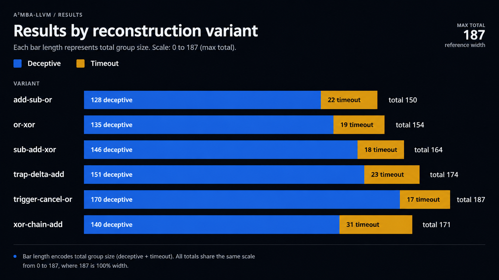
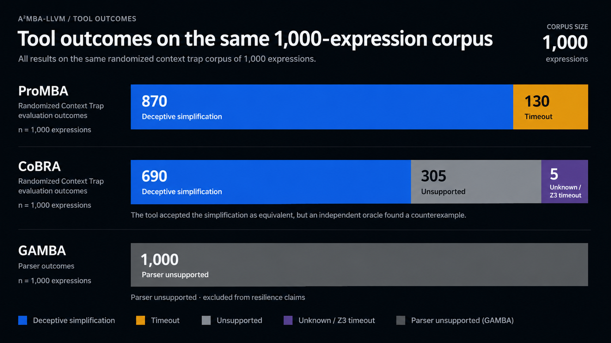
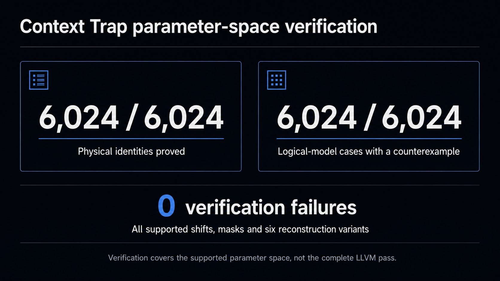

# Benchmarking

The tests cover equivalence, input-dependent multiplication surviving a fresh `-O3`, and ADC/SBB gadget diversity. The Windows run below measures compile time, size, and runtime for one specified build. Current flat-expression results for GAMBA, CoBRA, and ProMBA are below; none of those runs measures recovery of a whole stateful region.

## Bitwright probe (Windows, 2026-09-25)

The run used [Bitwright](https://github.com/valeria-org/bitwright) commit `4a4335c7091ee0328857de41f69b4f25b388b4b3` (`bitwright-cli` 0.11.0), built with Rust 1.95.0. Default `lift` runs its deobfuscation strategy with the native MBA solver; `--standard` leaves that solver out. Bitwright accepted both the protected LLVM IR and the standalone expressions. Parser rejections were not counted as wins.

With all three tools on `PATH`, the seed-9000 single-function probe is:

```powershell
$env:A2MBA_OPTIONS = 'mode=verified;level=heavy;seed=9000;functions=all;hybrid=ir;probability=100;depth=12'
a2mba-opt '-passes=a2mba,verify' -S test/IR/inverse-diversity.ll -o probe.ll
opt '-passes=default<O3>' -S probe.ll -o probe.o3.ll
bitwright lift --function hardening_pair probe.o3.ll
```

`hardening_pair` in `test/IR/inverse-diversity.ll` computes `lhs ^ rhs`. The pass protected this `i64` function with `hybrid=ir;level=heavy;probability=100;depth=12`, followed by LLVM 21.1.8 `default<O3>`. At seed 9000, both the former Newton-only build and the geometric-product inverse stayed as six-binding expressions after `bitwright lift --function hardening_pair`; neither reduced to XOR. Seed 9002 selects Newton in the new build and also stayed at six bindings. `--standard` recovered neither new variant. As controls, Bitwright did reduce `(x ^ y) + 2 * (x & y)` to `x + y` and `(x & y) * (x | y) + (x & ~y) * (~x & y)` to `x * y`.

For seeds 9000–9011, default `lift` recovered 0 of 24 protected functions from `test/IR/hardening.ll`, both before and after this change. The geometric product gives a different post-`-O3` shape, not an observed improvement in recovery rate over Newton. On the seed-9000 function, COFF `.text` was 245 bytes with Newton versus 210 bytes with the geometric product. That is one small object, not a runtime result. Bitwright also accepted the new build's three-operation `stateful_chain`; its post-`-O3` output kept 54 bindings instead of reducing to `(x + y ^ z) + 17`.

The small identity with `K = (x << 1) | 1` shows a width difference in Bitwright's default `simplify`. At 8 and 16 bits it reduces either inverse circuit to `x`. At 32 bits it reduces Newton but not the geometric product; at 64 bits it reduces neither. That difference did not show up as better recovery rates on the full plugin output: a 12-seed `i32` sweep of `test/IR/inverse-diversity-i32.ll` recovered 0/12 with either build.

In this pinned setup, Bitwright did not cancel the dynamically computed inverses. That is not evidence of an unsound rewrite or a general Bitwright weakness. The optional `--synth` search was stopped without a result and is excluded. Custom rules, different budgets, broader workloads, and binary-lifted inputs were not tested.

## CoBRA, GAMBA, and ProMBA (Windows, 2026-09-25)

This run used the current uncommitted Windows build, LLVM 21.1.8, and four functions from each of the five complexity presets. Each non-stateful control has one source operation; stateful functions chain two to seven. All 60 functions passed the corpus's 67-input equivalence check. That is a concrete-input check, not a proof. The project test suite also passed 8/8. [Run details and tool revisions](results/windows-simplifiers-2026-09-25.json) identify the tested binary.

| Mode | Changed | Flat export | CoBRA | GAMBA | ProMBA sample |
| --- | ---: | ---: | --- | --- | --- |
| hybrid IR | 16/20 | 20/20 | source-matching candidate for 16/16 changed | 5 correct reductions, 11 timeouts | 4/4 changed expressions reduced; equivalence unproved |
| hybrid IR + Context Trap + ADC/SBB | 17/20 | 18/20 | source-matching candidate for 15/15 exported changed | 15 parser rejections on right shift | 4/4 changed expressions grew |
| stateful hybrid IR, no outer layers | 20/20 | 0/20 | not run on whole regions | not run on whole regions | no whole-region result |

CoBRA's Windows CLI originally hit the command-line length limit on some flat inputs. A local build read the same expressions from files; the simplifier core was unchanged by that input adapter. On the 13 inputs the original CLI could launch, both builds returned identical candidates. The file-input build's Z3 verifier was not linked. An independent 64-bit Z3 check found each short candidate equivalent to the source expression, but source-to-protected equivalence here was sampled, not formally proved. The layered export also replaces the ADC/SBB assembly with its flag-aware identity. These numbers are for that algebraic projection, not for the binary.

ProMBA ran its SyGuS path on one flat-exported expression per complexity preset. Its four reductions of changed hybrid IR passed 132 additional concrete checks each, while the independent Z3 proof timed out; none became the short source expression. On the layered sample it expanded four changed expressions and left one unprotected expression unchanged. A separate stateful DAG probe returned only the name of the final C local variable: ProMBA's C reader does not follow the assignments that define it. That is an input-model mismatch, not evidence that it failed to simplify the region.

The 20 current stateful cases all changed, but even the smallest needs an estimated 8,141,813,417 nodes when flattened. After a fresh LLVM `default<O3>`, none fit the 100,000-node limit either; the smallest then needs an estimated 21,591,359 nodes. No whole-region expression was supplied to these three tools. This run therefore says that CoBRA still recovers the exported non-stateful expressions, not that stateful mode defeats it.

## Stateful-region snapshot

On 2026-09-19, an LLVM 21.1.8 run generated 100 `i64` expressions across five complexity presets with `hybrid=ir;hybrid-region=stateful;hybrid-layers=none`. Every site changed and passed the sampled equivalence check.

| Check | Result |
| --- | ---: |
| expressions | 100 |
| changed | 100 |
| sampled-equivalent | 100 |
| mean source nodes | 7.05 |
| mean protected DAG nodes | 419.02 |
| mean growth | 54.33x |
| bounded flat expressions exported | 0 |
| minimum full expansion | 351,382,325,827 nodes |

For `target_basic_001`, whose source is `(x ^ x) - y`, that build emitted 185 DAG nodes. Full inline expansion was estimated at 258,677,935,894,761 nodes, and LLVM `default<O3>` left 48 input-dependent multiplications. Operand stabilization for LLVM `undef` came later, so these counts belong to that build, not the current one.

This was a corpus and optimizer check. In this harness, ProMBA, CoBRA, and GAMBA take bounded single-return expressions; none of the stateful cases fit the 100,000-node flat-export limit. Those tools were therefore not run on this corpus. The counts and configuration are in [stateful-region-2026-09-19.json](results/stateful-region-2026-09-19.json).

## Windows performance snapshot

The 2026-09-25 run used Windows 11 build 26200, a Ryzen 5 5600G on the Balanced power plan, and a local LLVM 21.1.8 fork. This build includes operand stabilization for LLVM `undef`. CPU affinity and background processes were not controlled. The run does not validate the official portable LLVM package.

Each variant built the same 100-function workload: 20 functions each with 1, 2, 3, 5, or 7 source operations. The chain ran 1,000,000 times. Protection used `level=medium;probability=100;seed=10664542`. Each variant had three rotated builds, two warmups, and seven rotated timed runs. Every execution printed checksum `863b20d1323519df`.

| Mode | Compile median | EXE bytes | `.text` bytes | Runtime median | Runtime / plain |
| --- | ---: | ---: | ---: | ---: | ---: |
| plain | 0.363 s | 115,200 | 64,656 | 0.158 s | 1.00x |
| classic | 0.760 s | 188,928 | 138,320 | 6.710 s | 42.51x |
| hybrid IR | 4.822 s | 190,464 | 139,792 | 4.368 s | 27.67x |
| hybrid native | 4.592 s | 173,056 | 122,800 | 2.912 s | 18.44x |
| hybrid layered | 5.501 s | 276,480 | 225,840 | 6.023 s | 38.15x |
| stateful IR, no layers | 5.412 s | 254,976 | 204,400 | 8.879 s | 56.24x |

Stateful mode emitted 80 regions; the 20 one-operation functions cannot form regions. Native mode marked 90 functions protected, while the other protected variants marked 100. These counts describe what was emitted, not how difficult it is to simplify.

Stateful mode was the slowest here even without outer layers. Runtime includes process startup and checksum work; size includes linked runtime code. These are not whole-application slowdown estimates, and no external simplifier ran in this measurement. Exact options, raw times, coverage, and hashes are in [windows-performance-2026-09-25.json](results/windows-performance-2026-09-25.json).

## Historical result sets

The next two runs predate the nonlinear envelope, stateful regions, and polymorphic ADC/SBB gadgets. Their hashes and counts still identify those artifacts; their resilience and overhead numbers do not describe the current pass.

## Historical hybrid baseline

The 2026-09-18 LLVM 21.1.8 run compared four configurations before nonlinear hardening:

| Name | Configuration |
| --- | --- |
| classic | `hybrid=off;hybrid-layers=none` |
| hybrid IR | `hybrid=ir;hybrid-layers=none` |
| hybrid native | `hybrid=native;hybrid-layers=none` |
| hybrid layered | `hybrid=ir;hybrid-layers=context-random` |

Each mode took the same 100 single-operation `i64` inputs, 20 per complexity preset. The complexity preset changes the protection profile and hybrid search budget, not source-expression length. "Changed" means the exported expression differs from its source.

| Mode | Changed | Full-width proof | Unknown | Mean nodes after | Mean growth |
| --- | ---: | ---: | ---: | ---: | ---: |
| classic | 46/100 | 100 | 0 | 17.14 | 5.71x |
| hybrid IR | 82/100 | 95 | 5 | 51.64 | 17.21x |
| hybrid native | 58/100 | 100 | 0 | 24.55 | 8.18x |
| hybrid layered | 83/100 | 90 | 10 | 129.64 | 43.21x |

Z3 had five seconds per expression; cvc5 had ten seconds when Z3 returned unknown. Unknown was not counted as proven equivalent. The timing workload printed no computed result, so comparing its empty output did not check runtime equivalence. The correctness counts above come from the separate expression oracle.

### External simplifiers

Only changed sites are counted below. "Correct" means the reduction is smaller than the protected expression and equivalent to the original under an independent full-width oracle. "Deceptive" means smaller but not equivalent. CoBRA's own `--verify` result did not decide that classification.

| Mode | GAMBA | CoBRA | ProMBA fixed sample |
| --- | --- | --- | --- |
| classic | 33 correct, 13 unsupported | 33 correct, 8 deceptive, 5 unsupported | 0/20 reduced |
| hybrid IR | 82 correct | 63 correct, 19 unknown | 0/20 reduced |
| hybrid native | 58 correct | 53 correct, 5 unknown | 0/20 reduced |
| hybrid layered | 1 correct, 82 unsupported | 1 correct, 28 deceptive, 6 unchanged, 14 unknown, 26 unsupported, 4 timeout, 4 failed | 0/20 reduced |

ProMBA received the first four expressions from each of five complexity groups: 20 per mode. It changed none of the 80 outputs. Of those samples, A²MBA had changed 9 classic, 17 hybrid IR, 11 hybrid native, and 16 hybrid layered expressions.

The old unlayered hybrid IR and native outputs were linear MBA. GAMBA reduced all changed hybrid IR expressions correctly; CoBRA reduced most inputs it could resolve. In the layered mode, GAMBA rejected 82 inputs at parsing. That is a compatibility limit, not resistance. CoBRA produced one independently confirmed reduction and 28 reductions rejected by the independent oracle among 83 changed layered inputs.

### Compile time, size, and runtime

The performance workload has 100 dependency-preserving functions; the chain runs 250,000 times. Five full builds were measured, with three warmups and 15 rotated timed runs. File size is the complete ELF executable; `.text` is separate.

| Mode | Compile | File size | `.text` | Runtime |
| --- | ---: | ---: | ---: | ---: |
| plain | 0.344 s / 1.00x | 24,144 B / 1.00x | 4,329 B / 1.00x | 0.0406 s / 1.00x |
| classic | 0.599 s / 1.74x | 85,584 B / 3.54x | 67,497 B / 15.59x | 3.224 s / 79.39x |
| hybrid IR | 4.058 s / 11.79x | 40,528 B / 1.68x | 20,633 B / 4.77x | 0.1568 s / 3.86x |
| hybrid native | 3.999 s / 11.62x | 48,720 B / 2.02x | 28,601 B / 6.61x | 0.1759 s / 4.33x |
| hybrid layered | 4.532 s / 13.16x | 65,104 B / 2.70x | 46,729 B / 10.79x | 0.5261 s / 12.96x |

These ratios are for the old build, one synthetic workload, and a Ryzen 5 5600G under WSL2. They are not measurements of the current nonlinear pass.

The [result manifest](results/hybrid-baseline-2026-09-18.json) contains aggregate outcomes, upstream revisions, hashes, environment, and limits.

To regenerate the corpus and performance workload:

```bash
python scripts/baseline.py \
  --opt /path/to/opt-21 \
  --clang /path/to/clang-21 \
  --llc /path/to/llc-21 \
  --llvm-size /path/to/llvm-size-21 \
  --cvc5 /path/to/cvc5 \
  --plugin /path/to/A2MBA.so \
  --output /path/to/results \
  --per-level 20 \
  --compile-runs 5 \
  --warmups 3 \
  --runtime-runs 15 \
  --loop-iterations 250000
```

`--performance-only` runs the workload measurement without corpus export or per-expression equivalence checks.

## Historical randomized Context Trap evaluation

This 2026-08-22 run used LLVM 21.1.8 before the nonlinear envelope was added to Context Trap. The harness generated 1,000 expressions, split evenly between `i32` and `i64`, with exactly one Context Trap layer each. It was not a mixed-profile run.

| Setting | Value |
| --- | --- |
| mode | `verified` |
| level | `heavy` |
| transform | `context-trap` |
| probability | `100` |
| depth | `1` |
| seed base | `2725928960` |

An independent full-width bit-vector check found all 1,000 protected expressions equivalent to their originals before classifying simplifier output. The corpus had 878 distinct protected expressions and 566 distinct parameter sets.

### ProMBA

ProMBA returned 870 deceptive simplifications, 130 top-level timeouts, and no correct simplifications. DSR is 100% among the 870 completed results. The 130 timeouts are reported separately, following the authors' denominator.


All six reconstruction variants appeared. Their group sizes differ because variant selection was random; the bars show the actual counts.



### CoBRA and GAMBA

CoBRA and GAMBA received the same corpus. CoBRA accepted 690 deceptive simplifications, rejected 305 inputs as unsupported, and returned five unknowns after internal Z3 timeouts; it did not crash. In the 690 deceptive cases, CoBRA's model considered its reduction equivalent, but an independent full-width oracle found a counterexample.

GAMBA could not parse any of the 1,000 inputs because they contain arithmetic right shift. Those parser failures say nothing about whether GAMBA could simplify an equivalent supported representation.



### Parameter-space check

Z3 separately checked all 6,024 supported shift/mask/reconstruction combinations. Each preserved the real identity and gave a counterexample under the intentionally incomplete logical model. None failed verification.



This is the old forced depth-one Context Trap experiment. It did not measure the current nonlinear envelope, a full `heavy` profile, architectural transforms, runtime, size, or manual analysis. It also used a different corpus from the authors' experiment.

The [1,000 expression pairs](results/context-trap-1000-expressions.jsonl) are available as JSONL. The [result manifest](results/context-trap-1000.json) records their SHA-256, settings, counts, and hashes of local tool reports. Per-expression tool traces and the external harness are not checked in, so CI does not rerun this experiment.

## Published prototype results

The authors reported these factors for their LLVM 15 prototype:

| Paper level | Runtime factor | Code-size factor |
| --- | ---: | ---: |
| Light | 1.8x | 2.1x |
| Medium | 3.0x | 3.5x |
| Heavy | 5.5x | 6.3x |

They are not overhead figures for A²MBA-LLVM. The LLVM version, implementation, presets, corpus, and environment differ.

## Local runtime and size measurement

`scripts/benchmark.py` builds the same source twice with one LLVM 21 Clang and the same compiler arguments:

1. protected, through `a2mba-clang`;
2. baseline, through plain Clang.

It alternates runs, compares stdout and stderr, records whole-process wall time, and reports medians and file-size ratios:

```bash
python scripts/benchmark.py \
  --clang clang-21 \
  --plugin build/lib/A2MBA.so \
  --level balanced \
  --seed 1337 \
  --iterations 20 \
  --warmups 3 \
  --json results/verify-balanced.json \
  path/to/workload.c -- -DNDEBUG
```

On Windows with the standalone driver, use `--opt C:\path\to\a2mba-opt.exe` instead of `--plugin`. For a program argument starting with `-`, use `--run-arg=value` before the source path.

The helper defaults to `functions=all` so an unannotated sample does not pass through untouched. Use `--functions annotated` when the source includes `sdk/a2mba.h` and annotations are part of the test.

The script rejects compiler flags that change its output path or mode. It will not overwrite retained binaries or a JSON report. It invokes the compiler and program without a command shell.

### Interpretation limits

Short workloads can mostly measure process startup. The reported size is the whole executable, not just `.text`.

The workload must print deterministic output. If it prints timestamps, random values, addresses, or its own timing, fix that before benchmarking; do not turn off output comparison to make the run pass.

## Determinism and diversity

`scripts/diversity.py` compares object files, avoiding linker variability. It requires two builds with the base seed to have the same SHA-256 hash, then checks that consecutive seeds produce different hashes:

```bash
python scripts/diversity.py \
  --clang clang-21 \
  --plugin build/lib/A2MBA.so \
  --level balanced \
  --base-seed 1000 \
  --variants 100 \
  path/to/workload.c -- -DNDEBUG
```

For the supplied workload and toolchain, this checks reproducibility at one seed and byte differences across seeds. It does not measure entropy, clustering resistance, or semantic diversity. Identical hashes can also mean no eligible operation was transformed; the hash alone cannot explain why.

On Windows, the helper passes `-mno-incremental-linker-compatible` to make Clang write a zero COFF timestamp. SHA-256 still covers the whole object; no bytes are stripped or normalized afterward. With incremental-linker compatibility enabled, timestamps alone can break the same-seed check.

`--output-dir` keeps the variants for inspection. Otherwise the temporary objects are removed.

## Combined validation

To build, test, and run a small sample:

```bash
python scripts/validate.py \
  --llvm-dir /path/to/llvm-21/lib/cmake/llvm \
  --sample path/to/workload.c \
  --diversity-variants 4 \
  --benchmark-iterations 3
```

Without `--sample`, `validate.py` configures and builds the project, runs CTest, and calls `a2mba-clang --doctor`. It stops at the first failure.

For stateful mode, pass `--hybrid ir --hybrid-region stateful` or `--hybrid native --hybrid-region stateful`. `benchmark.py`, `diversity.py`, and `validate.py` accept both flags. Region mode defaults to `none`; benchmark JSON records it as `hybrid_region`. Put benchmark/diversity options before the source path.

## Reproduction data

To reproduce a measurement, record:

- repository revision;
- complete Clang/LLVM version and target triple;
- plugin build type and sanitizer status;
- operating system, CPU, power profile, and core pinning policy;
- source workload revision and input;
- exact compiler arguments and `A2MBA_OPTIONS`;
- warmup and measured iteration counts;
- raw per-run times, medians, and binary sizes;
- whether outputs and exit codes matched;
- object hashes and seeds for diversity runs.

Run both baseline and protected builds repeatedly; one ratio hides variance. Decide exclusion rules before measuring. Report performance, size, correctness, and simplifier outcomes separately.

## Running another resilience experiment

`scripts/baseline.py` handles classic, hybrid IR, native, layered, and stateful modes. It checks local equivalence, compile time, size, and runtime. Its `i64` expression reader accepts straight-line functions but rejects unsupported instructions, side effects, dynamic shifts, and poison-producing shift counts. It projects an architectural wrapper to an identity only when its instructions and operand contract match a supported form.

The performance workload uses the supplied Clang's native triple. It folds each function result into a printed 64-bit checksum. Initial, warmup, and timed runs must match the plain executable; empty output, mismatch, stderr, or nonzero exit fails the run. A regression compares generated workloads with a Python model at `-O0` and `-O3` and verifies that changing one operation is caught. The checksum samples behavior; it is not an equivalence proof.

The plain build disables function selection even if the shell has `A2MBA_OPTIONS` set. Build and runtime order rotate between variants. Reports include the checksum, target triple, workload hash, options, individual times, executable size, and `.text` size. Runtime includes startup and checksum output; `.text` includes linked runtime code.

Before expanding shared DAGs into trees, every mode applies `--max-flat-nodes`; zero turns flat export off. Records always keep the DAG. `flat-expressions.jsonl`, `promba-flat.c`, `gamba.txt`, and `cobra.txt` contain only expressions that fit. The C export keeps unsigned constants and typed arithmetic right shifts. The generic export rewrites arithmetic right shift with logical shifts and a sign-bit bias, then checks the node limit on that form. No flat export means the harness hit its limit, not that a simplifier failed.

GAMBA, ProMBA, CoBRA, MBA-Blast, and symbolic-execution tools are not bundled. To repeat an external-tool run, pin revisions and resource limits, check parser and bit-vector conventions against the exported input, and use an independent equivalence oracle. Only the historical Context Trap corpus is checked in; the external harness and other raw corpora are not.
